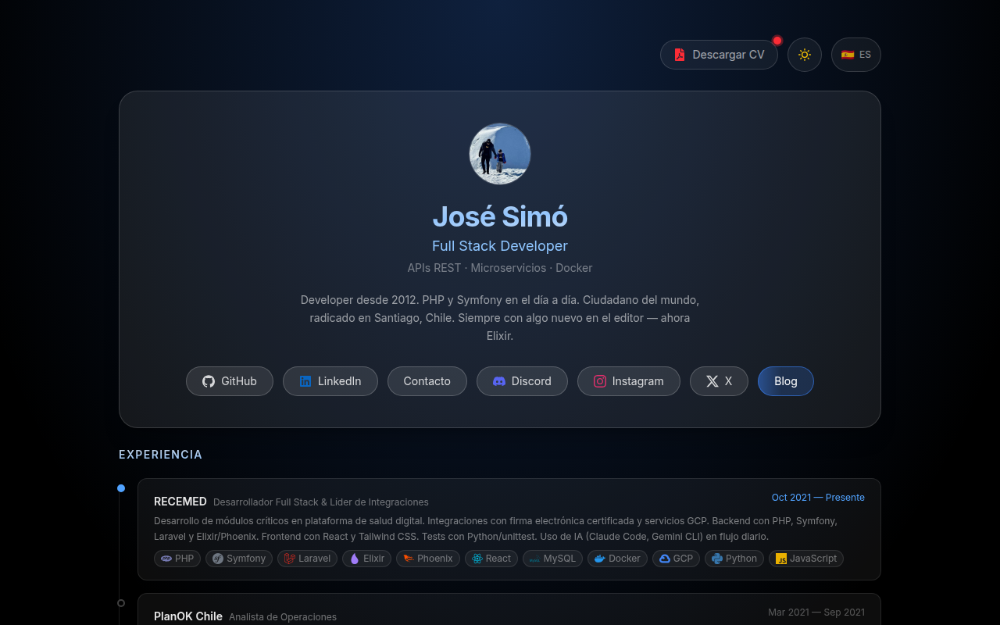
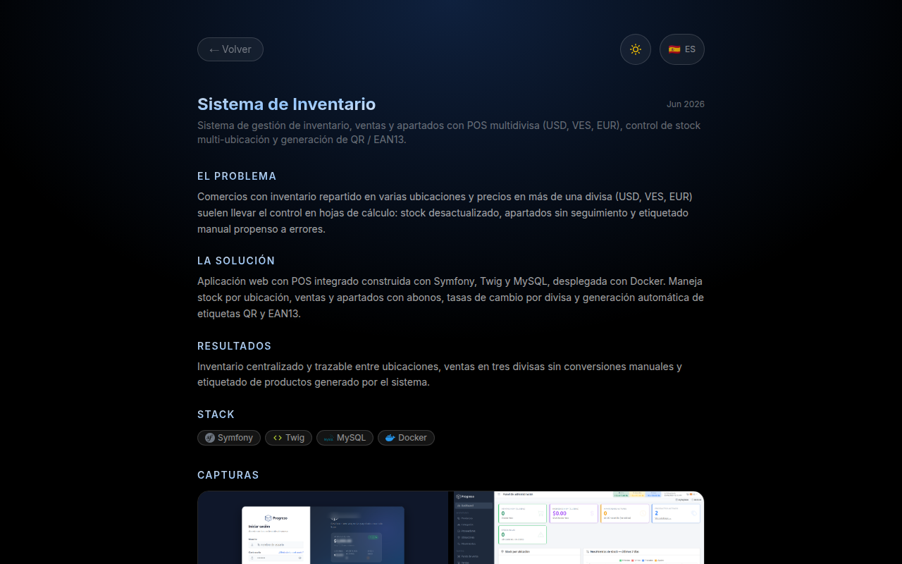

# jrsimog.github.io — Portfolio & Blog

[](https://react.dev)
[](https://vite.dev)
[](https://tailwindcss.com)
[](https://jrsimog.github.io)

Portfolio y blog personal de José Ramón Simó — desarrollador Full Stack con experiencia en PHP/Symfony, Elixir y Docker. SPA bilingüe (ES/EN) con tema claro/oscuro, blog con playgrounds interactivos y case studies de proyectos.

**En vivo:** [jrsimog.github.io](https://jrsimog.github.io)

## Screenshots

| Home | Case study de proyecto |
|---|---|
|  |  |

## Stack

- **React 19** + **Vite 8** + **Tailwind CSS 4**
- **React Router 7** para navegación SPA (con fallback `404.html` para GitHub Pages)
- **Google Analytics 4** (solo en producción)
- i18n manual ES/EN con `LanguageContext`
- Tema claro/oscuro con `ThemeContext`
- Animaciones con `ScrollReveal` (Intersection Observer) y transiciones entre rutas
- `sitemap.xml` generado automáticamente en cada build (plugin en `vite.config.js`)

## Desarrollo local

```bash
npm install
npm run dev      # servidor de desarrollo en http://localhost:5173
```

Otros comandos:

```bash
npm run lint     # ESLint
npm run build    # genera /dist (incluye sitemap.xml)
npm run preview  # sirve el build de producción
```

## Deploy

El deploy a GitHub Pages es automático vía GitHub Actions al hacer push a `master`. No hay pasos manuales.

## Estructura

```
src/
├── components/     # UI compartida: ProjectCard, Lightbox, StickyNav,
│                   # ThemeToggle, LangToggle, ScrollReveal, ShareButtons...
├── context/        # ThemeContext, LanguageContext
├── data/           # Contenido: projects, experience, education, posts, techIcons
├── i18n/           # translations.js (ES/EN)
├── pages/          # Home, Blog, ProjectDetail, NotFound
│   └── posts/      # Un componente por post del blog
└── utils/          # analytics.js, readingTime.js
```

El contenido (experiencia, proyectos, posts, educación) vive en `src/data/` como módulos JS — no hay CMS ni backend.

## Cómo agregar un post al blog

1. Crea el componente del post en `src/pages/posts/` (por ejemplo `MiPost.jsx`). Los posts son componentes React completos: pueden ser texto o playgrounds interactivos. El contenido va en ES y EN (revisa `ElixirHelloWorld.jsx` como referencia).
2. Regístralo en `src/data/posts.js` con sus metadatos:
   ```js
   {
     slug: "/blog/mi-post",
     Icon: SiElixir,            // ícono de react-icons
     tag: "Elixir",             // tecnología principal
     type: "playground",        // "playground" | "pildora"
     title: "Título en español",
     title_en: "Title in English",
     description: "Descripción corta en español.",
     description_en: "Short description in English.",
     date: "Jul 2026",
     wordCount: 450,            // palabras del contenido — alimenta el tiempo de lectura
   }
   ```
3. Agrega la ruta en `src/App.jsx`:
   ```jsx
   <Route path="/blog/mi-post" element={<MiPost />} />
   ```

El sitemap, la navegación entre posts (`[` / `]`), los botones de compartir y el tiempo de lectura se actualizan solos a partir de `posts.js`.

## Cómo agregar un proyecto

Agrega el objeto en `src/data/projects.js` con descripción, case study (`problem_*`, `solution_*`, `outcome_*` en ES/EN), stack y screenshots (las imágenes van en `public/projects/`). La tarjeta en el home y la página `/projects/:id` se generan solas.
